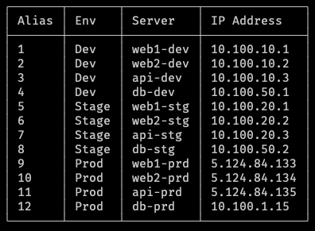

# server-menu

This is a simple shell server menu.




## Usage

This script will display a server menu each time you open your shell and give you aliases to just type in a server number to connect to it. After disconnecting, it will display what server name you just disconnected from and re-display the server menu.

You can view the server menu anytime by running `menu` .


## Setup

### Step 1.  Clone this repo to ~/bin/server-menu/

```shell
mkdir -p ~/bin/
cd ~/bin/
git clone git@bitbucket.org:dhouseholder-ia/server-menu.git
```


### Step 2.  Create your configuration

Copy the config-example.txt to example.txt

```shell
cd server-menu
cp config-example.txt example.txt
```


### Step 3.  Edit this new config.txt file and update your username, your computer name, server suffix, and list of servers.

```shell
vim config.txt
```

Follow the comments and examples. If you need to use a different username for different servers, leave the username field blank and add the username before the servername using the following format:

```
ENV:USER@SERVERHOSTNAME
```

For example:

```
Prod:jimmy@appserver1
```


### Step 4.  Add the following to your ~/.bash_profile:

```shell
source ~/bin/server-menu/server-menu.sh
set_title
menu
```


### Step 5.  Close your shell and re-launch

Close your terminal and re-open it. You should immediately see the menu.


### Note:

If you need to update any servers, just edit the `config.txt` file, and add/edit the servers in the `servers` array, then save the file. Finally, run `generate_menu` to update the server list, and run `menu` to see the updated menu.

